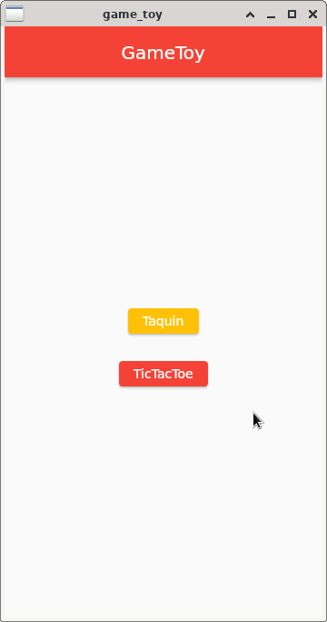

## Description

Dans le cadre d’un projet de 2eme année de bts SIO j’ai créer une application "GameToy" regroupant des jeux jouable depuis une interface graphique dans le language de programmation dart et le framework flutter. Il comporte pour l'instant le jeu du taquin et le jeu du morpion.

## Installation

L'application est directement prête à être utilisée

## Aperçu

